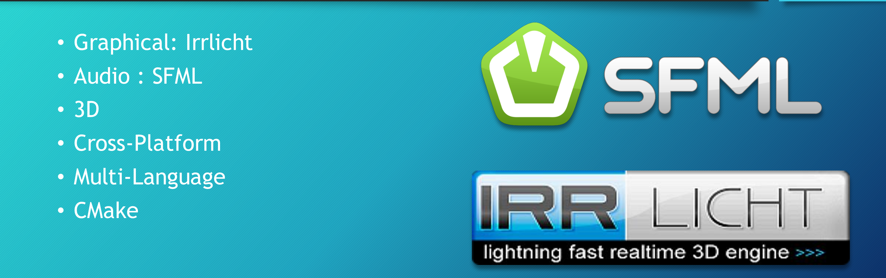
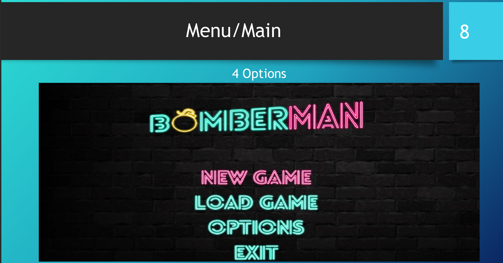
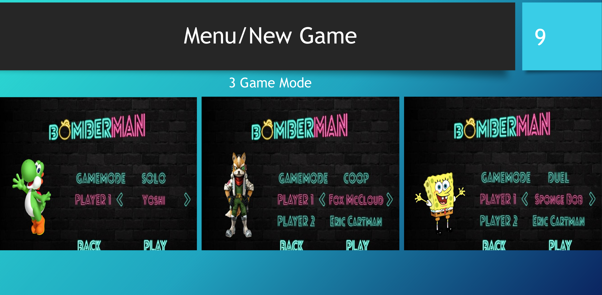
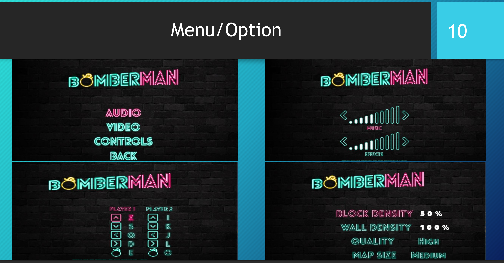
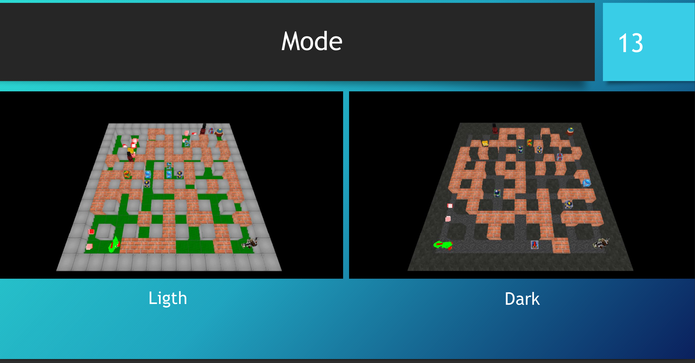

# Bomber_Man_cpp (made in 2018)
## Bomberman game made in cpp

To create Makefile (in Linux env/can work on Windows):

    cmake . -G "Unix Makefiles"

to create binary :

    make

To launch game :

    ./build/bomberman

To do above

    cmake . -G "Unix Makefiles" && make && ./build/bomberman

To clean directory :

    make fclean

## Description

## Menu

## Animation

## Map

